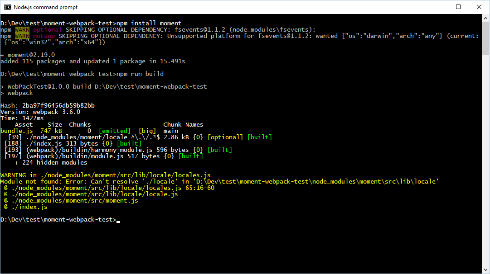

# moment-webpack-test

Updating to Moment 2.19.0 breaks a webpack build.  This repo has a 2.18.1 version that is working, in it's initial commit.  Then updating to 2.19.0 and re-running `npm run build` to kick off webpack fails with the following warning, and results in a broken application.

